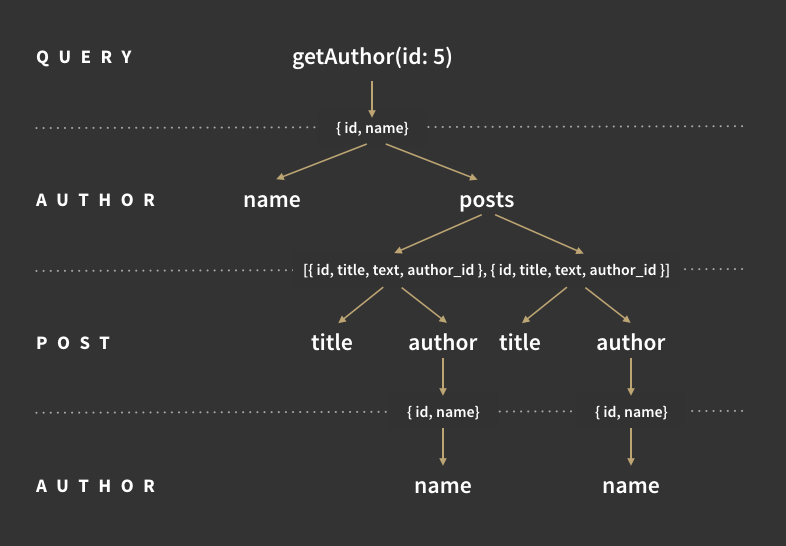
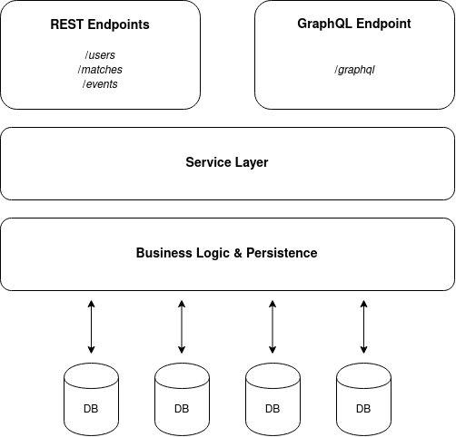

# REST e GraphQL: due approcci a confronto 

## Introduzione
I servizi web sono ormai una parte fondamentale di Internet, la quasi totalità delle comunicazioni che coinvolgono dispositivi consumer consistono in applicazioni che contattano un server per scambiare dati sfruttando sistemi basati su servizi. Persino gli stessi server si scambiano informazioni mediante queste interfacce, e i sistemi IoT promettono di sfruttare questo paradigma con flussi informativi importanti.
Le architetture basate sui servizi (SOA) si sono evolute in direzioni diverse, ma mantenendo comunque alcuni punti in comune, come l'uso di HTTP come protocollo di trasporto. SOAP, REST e le architetture a microservizi sono alcuni esempi. 

## Le criticità dei modelli a risorse
Nel corso degli anni, sia SOAP che REST sono stati "accusati" di aggiungere overhead o comunque di non saper sfruttare al massimo il medium. SOAP viene additato principalmente per la complessità del protocollo e le performance del parsing di XML; REST invece si appoggia totalmente su HTTP, senza bisogno di definire un ulteriore livello. L'utilizzo dei verbi di HTTP e degli header integrati nelle richieste, oltre a definire una certa semantica nella costruzione degli URL ed ad usare meno banda lo hanno reso l'architettura preponderante nella costruzione di servizi web negli ultimi anni.

Le critiche a REST vertono principalmente sulla tendenza all'*under/over-fetching*: la rigidità della rappresentazione degli oggetti porta a dover fare richieste aggiuntive o a ricevere troppi dati rispetto a quelli effettivamente richiesti. Questo aspetto può essere mitigato progettando bene le rappresentazioni restituite, ma è innegabile che per la stessa natura dell'architettura è impensabile pretendere di ricevere dati su misura in base al caso d'uso.

##  Un nuovo approccio(?)
Nato in seno a Facebook, GraphQL è una libreria che promette di "rivoluzionare" l'interazione client/server. Il *selling point* è la possibilità di far specificare al client quali dati ha effettivamente bisogno, in modo da ridurre il numero di richieste ad una sola risolvendo alla base *under/over-fetching*. Nella sostanza è un linguaggio per creare query da inviare al server, permettendo anche di specificare i tipi per definire i dati.

### Introduzione a GraphQL
Solitamente, un servizio basato su GraphQL è raggiungibile tramite un unico endpoint (es: `http://server-url/graphql-endpoint`), attraverso cui è possibile inviare e ricere dati per qualsiasi tipo di risorsa tratti il servizio. 

GraphQL distingue due tipi di richieste:

- Le interrogazioni: **Query**
- Gli inserimenti/aggiornamenti: **Mutazioni**

Entrambi i tipi devono avvenire tramite una POST, dove nel corpo della richiesta devono essere contenuti i dati da inviare o quelli richiesti. Prima di essere elaborata, qualsiasi richiesta viene validata per assicurarsi che i campi e i tipi richiesti vengano riscontrati nello schema definito.

Lo schema seguente potrebbe definire una collezione di auto per una concessionaria:

	type Dealer {
	   catalogue: [Cars]
	}

	type Car {
	   model: String!
	   brand: Manifacturer! 
	   ports: Integer
	   power: Integer
	   color: String
	   ....
	}

	type Manifacturer {
	   name: String!
	}

L'attributo `brand` è di tipo `Manifacturer`, mentre il punto esclamativo `!` accanto ad alcuni campi li indica come *non-nullable*.

Una query che volesse richiedere un produttore potrebbe essere la seguente:

	{
	   Manifacturer {
		name
	   }richiesti si riferiscano a qualcosa che esiste nello schema.

	{
	   "Manifacturer" {
		"name": "Ford"
	   }
	}

Ma la vera espressività si apprezza con liste di oggetti, dove è possibile richiedere solo i campi necessari e addirittura filtrarli in base a parametri.

	{
	   Car(filter: { ports_lt: 3}) {
		ports
		model
		brand
	   }
	}

	{
	   "Car" {
		{
		    "brand": "Toyota",
		    "model": "Aygo",
		    "ports": 3
		}
		{
		    "brand": "Ford",
		    "model": "Ka",
		    "ports": 3
		}
		{
		    "brand": "Ferrari",
		    "model": "458 Italia",
		    "ports": 3
		}
	    }
	}

Le mutazioni - ovvero l'inserimento o l'aggiornamento di dati - vengono gestite in maniera analoga. Interrogando lo schema è possibile anche farsi restituire le query e le mutazioni disponibili.

### GraphQL dietro le quinte
Ogni server GraphQL è composto di due parti fondamentali: lo schema e i resolver.

Lo **schema** è gia stato mostrato, è un modello dei dati che possono essere restituiti tramite l'endpoint GraphQL. Definisce le query disponibili ai client e le relazioni tra i vari tipi. La provenienza dei dati è volutamente nascosta, in modo da mantenere una separazione tra client e backend.

I **resolver** specificano come i tipi e i campi presenti nello schema sono connessi al backend. Si occupano quindi di descrivere come recuperare i dati da un database, o addirittura da un altro endpoint GraphQL. Sono parte integrante del server GraphQL, rendendo il client non consapevole della provenienza dei dati.

#### Elaborazione di una query
Gli step effettuati dal server una volta ricevuta la query sono tre:

1. **Parsing**: il server parsa la stringa e la trasforma in un albero sintattico, controllando eventuali errori nella sintassi.
2. **Validazione**: la query viene validata rispetto allo schema definito, verificando che i campi richiesti appartengano alla classe a cui fanno riferimento e che i parametri siano dello stesso tipo definito nello schema. Nel caso un campo non appartenga alla classe gli viene assegnato automaticamente il valore `null`.
3. **Esecuzione**: Le query GraphQL sono assimilabili ad alberi, ovvero a grafi aciclici, c'è quindi una garanzia di terminazione risolvendo ricorsivamente la query a partire dalla sua radice. Vengono risolti prima i campi "primitivi" presenti alla radice, a seguire vengono eseguiti i riferimenti ad oggetti, chiamando i loro rispettivi risolutori. Una volta disceso tutto l'albero viene assemblata la risposta e inviata al client.

## GraphQL e REST alla prova sullo stesso web service 
La progettazione e la realizzazione di un servizio web adesso si fa più interessante: se prima la scelta di creare API REST era quasi scontata, oggi è possibile utilizzare un approccio alternativo e funzionalmente equivalente grazie a GraphQL. Esiste anche la possibilità di integrare l'uso della libreria in progetti già esistenti, oltre a realizzare ex-novo sistemi che supportino entrambi i tipi di endpoint.

[Arcano](https://github.com/rickie95/arcano) è un esempio di come quest'ultima possibilità possa essere implementata, facendo coesistere endpoint REST e GraphQL sullo stesso backend: è sufficiente una buona astrazione sul service layer, in modo tale da renderlo fruibile in maniera trasparente rispetto a quale tecnologia si sta utilizzando. In questo modo si possono addirittura alternare richieste tramite endpoint REST a richieste effettuate tramite GraphQL.

Nell'implementazione proposta - realizzata in Java - è possibile vedere che la maggior parte delle funzionalità esposte negli endpoint REST sono perfettamente replicate e gestibili anche tramite l'endpoint univoco `/graphql`. Solamente il servizio di autenticazione è offerto esclusivamente un endpoint dedicato REST, ed il motivo è da imputare solamente all'implementazione GraphQL utilizzata, fornita da Smallrye, che attualmente non prevede un meccanismo dedicato per questa evenienza.
L'implementazione è comunque interessante perché genera automaticamente lo schema a partire da quanto scritto nei Provider/Resolver di GraphQL, permettendo un approccio code-first.

Analogalmente alla controparte REST, utilizzando questa libreria si è in grado di scrivere un Provider dedicato per ogni tipo di risorsa:

	EventGraphQLProvider.java
	MatchGraphQLProvider.java
	UserGraphQLProvider.java

Dove all'interno è sufficiente annotare le query e le mutazioni che si intende esporre:

	@GraphQLApi
	public class EventGraphQLProvider {
	
		@Query("eventList")
		public List<Event> getEvents() {
			[.....]
		}
	
		@Query("eventById")
		public Event getEventById(@Name("id") Long eventId) {
			[......]
		}
		
		@Mutation("addEvent")
		public Event addEvent(Event event) {
			[......]
		}
		
		@Mutation("updateEvent")
		public Event updateEvent(Event event, @Name("jwt") String token) {
			[......]
		}
	}

Le annotazioni `@Query` e `@Mutation` identificano i tipi di operazioni disponibili, con la possibilità di specificare il nome tra le parentesi. `@Name` invece fa riferimento ad un parametro che deve essere presente nel corpo della richesta.

Lo schema - automaticamente generato - comprende le query, le mutazioni e anche il modello delle entità restituite dal provider:

	{
	    "data": {
		"__schema": {

			# Query
		    "queryType": {
			"fields": [
			    {
				"name": "eventById",
				"description": null
			    },
			    {
				"name": "eventList",
				"description": null
			    }
			]
		    },

			# Mutazioni
		    "mutationType": {
			"fields": [
			    {
				"name": "addEvent",
				"description": null
			    },
			    {
				"name": "updateEvent",
				"description": null
			    }
			    
			]
		    },

		    # Schema del modello di Event.
		    "types": [
		   	{                  
  			"name": "Event",
                "fields": [
					{
						"name": "adminList"
					},
					{
						"name": "id"
					},
					{
						"name": "judgeList"
					},
					{
						"name": "name"
					},
					{
						"name": "playerList"
					}
                ]
            }
		    ]
		}
	    }
	}

Il sistema è quindi pronto ad accettare richieste: di seguito una demo su come inserire un nuovo Event

	mutation addEvent {
  		addEvent(event: {
        	name: "Josh's Party",
        	adminList: [
				{
					id: "27",
					username: "joshTheAdmin"
				}
			],
			playerList: [
				(user: {
					id: "102",
					username: "magicMichael"
				}),
				(user: {
					id: "104",
					username: "rollerDice71"
				})
			],
  			}
  		)

		  # Qui sotto elenco gli eventuali campi di cui mi interessa avere un feedback
  		{
    		name
    		id
  		}
	}

La risposta, nel caso in cui la richesta vada a buon fine, sarà simile a:

	{
		"id": 557,
		"name": "Josh's Party",
		"playerList": [
			{
				"id": 102,
				"username": "magicMichael"
			},
			{
				"id": 104,
				"username": "rollingDice71"
			}
		],
		"judgeList": [],
		"adminList": [
			{
				"id": 27,
				"username": "joshTheAdmin"
			}
		]
	}

Da notare la presenza dell'ID nella risposta, che viene generato dal sistema e non dato come parametro in ingresso.
 
## Chi scegliere per il prossimo progetto?
Entrambi gli approcci sono assolutamente validi e offrono aspetti interessanti e vantaggiosi:

| REST | GraphQL|
|------|--------|
| Scaling indefinito | Scala con difficoltà
| Alte performance | Risente dell'overhead intrinseco |
| Payload fisso, over/under fetching | Il payload contiene esattamente quanto richiesto dal client |
| JSON, XML, ecc.. | Supporta solo JSON |
| Forte disaccoppiamento client-server, le API sono utilizzabili da qualunque client | Query e mutazioni vanno integrate nel client, tende a favorire la creazione di API pensate per un client proprietario.|
| Curva di apprendimento ripida, difficoltà a sfruttare ed a implementare tutti i vincoli REST (HATEOAS) | Prototipazione rapida, facilità di evoluzione delle API|
| Approccio *design-first*, è necessario avere i casi d'uso fin dall'inizio | Permette di definire prima lo schema, con la possibilità di ottimizzare le query più sfruttate dai client in un secondo momento |
| Load balancing immediato (con un server in testa), pieno compatibilità con microservizi | Non contempla la possibilità di un sistema distribuito, il routing deve essere fatto internamente con i Resolver/Provider |
| Rischio rompere la compatibilità con gli aggiornamenti -> versioning | Versioning non richiesto, possibilità di deprecare query e campi |
| Richieste cacheabili | Richieste non cacheabili |
| Uso dei verbi HTTP, codici di risposta | Tutto viene fatto tramite POST, ogni richiesta risponde con codice 200, anche quelle in errore |

La scelta di uno rispetto all'altro non può quindi essere assoluta, né prescindere il contesto in cui deve essere collocata. Una decisione priva di bias può essere presa  prendendo in considerazione e analizzando i **vincoli** a cui è soggetto il prodotto che si vuole realizzare:

- **Vincoli di businness**
	- dettati dal cliente
	- requisiti del prodotto
- **Vincoli di complessità**
	- performance, algoritmi
	- sistemi distribuiti
	- previsioni di evoluzione
- **Vincoli di dominio**
	- limitazioni, leggi, ambienti
- **Vincoli culturali**
	- Conoscenza delle tecnologie

Ovviamente è necessario sapere anche quali **proprietà o caratteristiche** devono possedere le API del servizio che si intende realizzare: 

- **Performance**: velocità di rete, efficienza, velocità percepita
- **Scalabilità**
- **Semplicità**: interfaccia uniforme, percepita, algoritmica, architetturale
- **Modificabilità**: estensibilità, personalizazione, configurabilità, riusabilità
- **Visibilità**: monitoring, sicurezza, caching
- **Portabilità**: differenza di ambienti di sviluppo, testing, deployment
- **Affidabilità**: tasso di failure, resilienza e recovery
- **Esplorabilità**: runtime, design-time
- **Tipizzazione**
- **Facilità di sviluppo**
- **Efficienza di costo**: time to market, costi di sviluppo/mantenimento/refactoring

Alcune di queste proprietà (le prime sette sicuramente) sono automaticamente indotte dalla scelta di implementare API REST; GraphQL porta con sè nuovi vantaggi, come un'esperienza di sviluppo più immediata e dinamica.

## Conclusioni

L'approccio architetturale di REST è sicuramente più maturo e si rivolge a chi vuole un prodotto destinato a coprire un **orizzonte più vasto**, sia in termini di tempo che di utenza.
GraphQL invece può aiutare nei casi in cui si voglia sviluppare un servizio in **tempi molto rapidi** e non si conosce molto bene il dominio o non si riesce a definire i casi d'uso nelle fasi iniziali della progettazione.

**Non è possibile decretare un vincitore**: la scelta di uno e dell'altro deve quindi essere fatta tenendo a mente aspetti diversi che variano molto in base al contesto operativo. Un confronto del genere va affrontato tutte le volte che si vuole sviluppare un nuovo servizio, cercando di tenere in considerazione gli **obiettivi** e i **vincoli** a cui si è sottoposti e le caratteristiche a cui si vuole puntare per realizzare un prodotto che le rispetti in pieno.

----

### Riferimenti utili
- https://graphql.org/learn/
- https://github.com/graphql/graphql-js (implementazione di riferimento in JS)
- https://www.redhat.com/it/topics/api/what-is-graphql
- https://goodapi.co/blog/rest-vs-graphql
